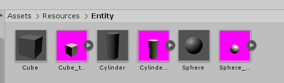

# ThumbnailBuilder.unity
Build prefab thumbnails in one click




And also generates database file like below:
```json
{
  "Cube": {
    "name": "Cube",
    "category": "None",
    "prefabPath": "Entity/Cube"
  },
  "Cylinder": {
    "name": "Cylinder",
    "category": "None",
    "prefabPath": "Entity/Cylinder"
  },
  "Sphere": {
    "name": "Sphere",
    "category": "None",
    "prefabPath": "Entity/Sphere"
  }
}
```


Usage
----
* Create a scene for thumbnail generation
* Change the background color of camera whatever you want. (white, black or magenta ...)
* Attach some nice PP effects to default scene camera.
* Click `Util/Build~~` button on the Unity menu.
